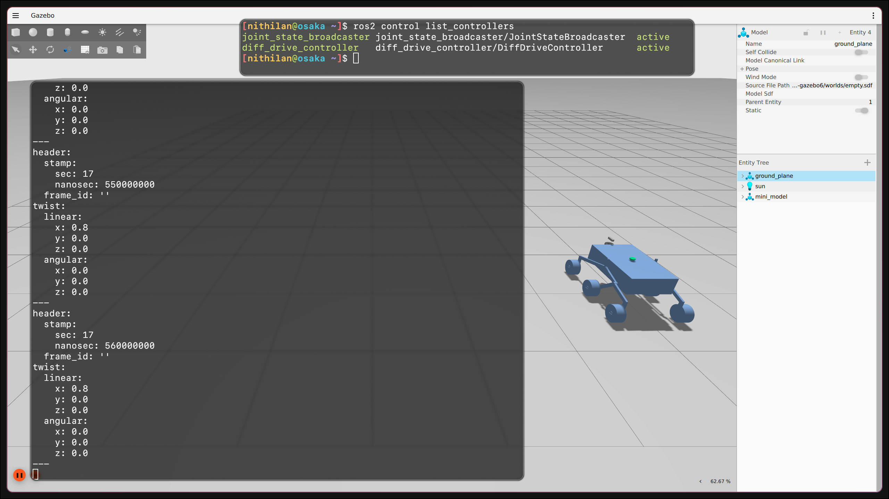

# Solution

I completed the core Category 2 simulation workflow:

1. Spawned the provided rover model in Gazebo and verified it appears correctly.
2. Configured and ran a differential drive controller using `ros2_control`.
3. Verified odometry and TF publishing from the active controller stack.

## What I Implemented

### 1) ROS2 package scaffolding for simulation
- Added package metadata and install rules for a launchable ROS2 package.
- Added launch/config directories under `mini_model_description`.

Files:
- `src/mini_model_description/package.xml`
- `src/mini_model_description/CMakeLists.txt`

### 2) Controller configuration and `ros2_control` integration
- Added `diff_drive_controller` and `joint_state_broadcaster` config.
- Mapped wheel joints for both sides.
- Enabled odom + TF publishing from controller config.

Files:
- `src/mini_model_description/config/rover_controllers.yaml`
- `src/mini_model_description/urdf/mini_model.xacro`

### 3) Single-command simulation launch
- Added launch file to start Gazebo, build `robot_description` from xacro, spawn model, and start controllers.

File:
- `src/mini_model_description/launch/sim.launch.py`

## Summary

- `joint_state_broadcaster` is active.
- `diff_drive_controller` is active.
- `/diff_drive_controller/cmd_vel` (stamped) accepts commands.
- `/diff_drive_controller/odom` is published.
- `/tf` includes controller-published transforms.

## Debugging Notes

- Minor friction: some model/joint names (for example `Revolute 29`, `component__11__1`) were not very descriptive, so mapping drive-side joints took extra validation.
- Build initially failed due to stale nested symlink: `meshes/meshes`.
